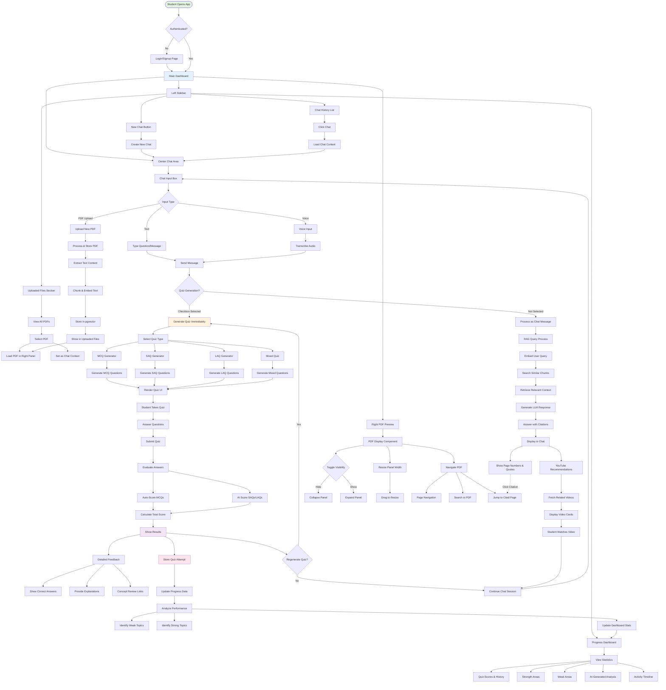

# Bookly AI

<p align="center">
  
</p>

## User Flow



<p align="center">
  <a href="https://nextjs.org"></a>
  <a href="https://react.dev"></a>
  <a href="https://tailwindcss.com"></a>
  <a href="https://ui.shadcn.com"></a>
  <a href="https://www.radix-ui.com"></a>
  <a href="https://supabase.com"></a>
  <a href="https://ai.google.dev"></a>
  <a href="https://developers.google.com/youtube"></a>
  <a href="https://zustand-demo.pmnd.rs/"></a>
</p>

Bookly AI is an AI-powered study assistant that lets you upload PDFs, chat with retrieval-augmented answers, generate quizzes, review progress, and explore related YouTube content. It uses Supabase for authentication and persistence, Google Gemini for generation, and a lightweight RAG pipeline for grounded responses.

## Highlights
- **Chat with RAG**: Ask questions; answers cite relevant PDF pages when available.
- **PDF ingestion**: Upload, parse, embed, and search your documents.
- **Quizzes and progress**: Generate quizzes, track attempts, view weaknesses and dashboard.
- **YouTube suggestions**: Surface related topics and recommended videos.
- **Auth & sessions**: Supabase auth with middleware-protected routes.

## Tech Stack
- **Framework**: Next.js 15 (App Router), React 19
- **Styling/UI**: Tailwind CSS v4, shadcn/ui components, Radix UI primitives, `lucide-react`
- **State**: Zustand
- **Auth/DB**: Supabase (`@supabase/ssr`, `@supabase/supabase-js`)
- **LLM**: Google Gemini (`@google/generative-ai`)
- **PDF**: `pdf-parse`, `@react-pdf-viewer/*`

## Monorepo structure (key paths)
- `app/` — Next.js routes (App Router) and API routes under `app/api/*`
- `components/` — UI components (layout, chat, files, quiz, progress)
- `lib/` — Server/client utilities: auth, env, RAG, quiz, Supabase clients
- `store/` — Zustand stores (auth, chat, pdf, quiz, ui)
- `db/migrations/` — SQL migrations for Supabase schema and features

---

## Local Development Setup

### 1) Prerequisites
- Node.js 18+ (LTS recommended)
- npm (comes with Node) or yarn/pnpm
- A Supabase project (free tier is fine)
- API keys for Google Gemini and optionally YouTube Data API v3

### 2) Create and configure Supabase
1. Create a new project at `https://supabase.com`.
2. In your project settings, locate:
   - `Project URL` (Supabase URL)
   - `anon` public key (Client)
   - `service_role` key (Server; keep private, server-only)
3. Apply the SQL migrations in order using the Supabase SQL Editor:
   - `db/migrations/0001_init.sql`
   - `db/migrations/0002_rls.sql`
   - `db/migrations/0003_phase1_extend.sql`
   - `db/migrations/0004_gemini_embeddings.sql`
   - `db/migrations/0005_RAG.sql`
   - `db/migrations/0006_youtube_recommendations.sql`
   - `db/migrations/0007_persistent_youtube_videos.sql`
   - `db/migrations/0008_cleanup_duplicate_videos.sql`
   - `db/migrations/0009_quiz_specific_youtube_videos.sql`

Note: Some features (RAG, quizzes, recommendations) require the later migrations.

### 3) Configure environment variables
Create a `.env.local` file in `bookly/` with:

```bash
# Google Gemini (required for chat and quizzes)
GEMINI_API=your_gemini_api_key

# YouTube Data API (optional; enables recommendations)
YT_API_KEY=your_youtube_api_key

# Server-side Supabase (service role used by API routes)
SUPABASE_URL=https://your-project-id.supabase.co
SUPABASE_ANON_API_KEY=your_anon_public_key
SUPABASE_SERVICE_KEY=your_service_role_key

# Public (browser) Supabase
NEXT_PUBLIC_SUPABASE_URL=https://your-project-id.supabase.co
NEXT_PUBLIC_SUPABASE_ANON_KEY=your_anon_public_key
```

Environment resolution:
- Server utilities use `SUPABASE_URL`, `SUPABASE_ANON_API_KEY`, `SUPABASE_SERVICE_KEY`.
- Browser client prefers `NEXT_PUBLIC_*` and falls back to server vars in dev.

### 4) Install dependencies

```bash
npm install
```

### 5) Run the dev server

```bash
npm run dev
```

Open `http://localhost:3000`.

---

## How Authentication Works
- Sign in/up pages: `/signin`, `/signup`.
- Middleware (`middleware.ts`) allows public paths and protects the rest by checking Supabase session cookies.
- Server APIs use `@supabase/ssr` to read/write session cookies and get the user.

If auth is not configured, protected routes will redirect to `/signin`.

---

## Core Features & Flows

### Chat with Retrieval
- Endpoint: `POST /api/chat`
- Pipeline:
  - Validate session → provision user row → optional rate limit
  - If `pdfId` present and ready, embed message and retrieve top chunks
  - Build prompt with identity + retrieved context
  - Stream responses from Gemini as JSONL frames (`delta`, `citations`, `done`)
  - Persist messages in `messages` table

### Messages History
- Endpoint: `GET /api/messages?chatId=...`
- Verifies chat ownership and returns ordered messages for the chat.

### PDFs
- Upload and view panels live under center/side panels.
- RAG utilities in `lib/rag.ts` handle embeddings, chunk search, prompt building.
- Status tracked in `pdfs` table; chunks stored in dedicated tables per migrations.

### Quizzes & Progress
- Quiz generation/evaluation endpoints under `app/api/quiz/*`.
- Dashboard and history in `app/api/progress/*` and UI under `components/progress/*`.

### YouTube Recommendations
- Endpoints under `app/api/youtube/*` with optional `YT_API_KEY`.

---

## Scripts
- `npm run dev` — Start Next.js dev server
- `npm run build` — Build for production
- `npm run start` — Start production server
- `npm run lint` — Run ESLint

---

## Troubleshooting
- "Authentication required" on protected pages:
  - Confirm `.env.local` has valid `NEXT_PUBLIC_SUPABASE_URL` and `NEXT_PUBLIC_SUPABASE_ANON_KEY`.
  - Ensure your Supabase Auth providers are enabled and redirect URLs include `http://localhost:3000`.

- Chat returns 500 "GEMINI_API missing":
  - Set `GEMINI_API` in `.env.local`.

- Missing data or SQL errors:
  - Verify all migrations in `db/migrations/` were applied in order.

- Windows or local TLS/cookie oddities:
  - The middleware and server helpers will try to decode the Supabase access token from cookies as a fallback.
  - Make sure third-party cookies are not blocked in the browser during local testing.

- PDF viewer issues (canvas/pdfjs):
  - The app stubs `canvas` in `next.config.ts`; ensure you’re not bundling `canvas` on the client.

---

## Security Notes
- Never expose `SUPABASE_SERVICE_KEY` to the browser or commit it to VCS.
- Use separate environment files or secrets for production vs. development.

---

## License
Proprietary. All rights reserved.

